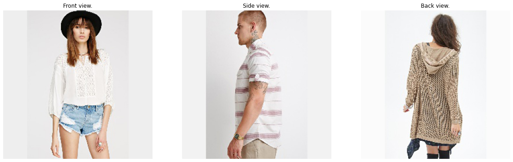
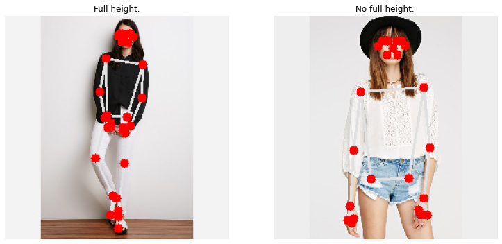
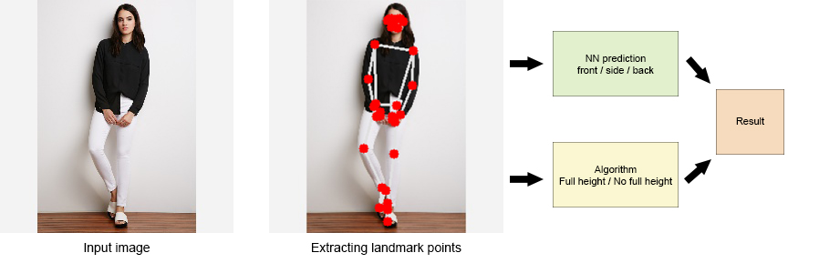

# <div align="center">Human Position Classification</div>
## Overview
The archive contains pictures from an online clothing store with people pictured from different sides - front, side and back. There are two goals to solve:
* classify the side from which the picture was taken;
* classify whether the picture contains full height of a human or not.
<p align="center"></p>
<p align="center">Samples from archive</p>

## Solution
To solve the problem I've choosen to use <a href="https://google.github.io/mediapipe/solutions/pose.html" title="Mediapipe">Mediapipe Pose Landmark Model</a> tool for computer vision. It allows to extract landmark points and, by processing them, solve the main tasks.

<p align="center"></p>
<p align="center">Description of landmark points</p>

It is safe to say that if the points on the head and on both feet (from 1 to 10 AND from 27 to 32) are found on the picture, the human is pictured full height. Therefore, when predicting, the algorithm will add all the visibility coefficients of that points in a list, and if the mean value is greater than 0.9, the human is pictured in full height.

<p align="center"></p>

Thankfully, the Mediapipe Pose Landmark Model sets a coordinates for each point in 3D, so by extracting them from each picture I can create a dataset for training a NN classification model.

## Dataset

The ``get_coordinates.py`` script creates a csv-file with [X, Y, Z] coordinates of each landmark. The script may take 2-3 hours to process.

The output of the script will be a csv-file in ``dataset/dataframe_coords.csv``. It is included in this repo, so there is no need to run it.

**NOTE:** It is required to have a ``img.zip`` and ``df.csv`` in a root directory.

```sh
python ./get_coordinates.py
```

If there is a need to run the training process, you must prepare a dataset files (not included in repo).

The output of ``dataset.py`` script will be two csv-files in ``dataset/train.csv`` and ``dataset/val.csv``, and also ``dataset/dataset.h5``.

```sh
python ./dataset.py
```

## Training

Before starting the training process, make sure that dataset files are prepared and available in ``./dataset/..`` folder. Then, run the ``train.py`` script with two arguments: first - the number of epochs, seconds - batch size.

```sh
python ./train.py 20 64
```

Pre-trained model was trained for 20 epochs with batch size of 64 in 25 minutes with validation accuracy around 92%.
Weights can be found at ``./weights/weights.h5``

## Predict

To predict an image, use ``predict.py`` script with first argument as a link to the image.

```sh
python ./predict.py ./misc/01_1_front.jpg
```

Output: front view. full height.

The script sends a landmark points into a neural network to predict whether it is a front, side, or back view.
Also, using algorithm, it decides whether it is a full height human, or not.

<p align="center"></p>
